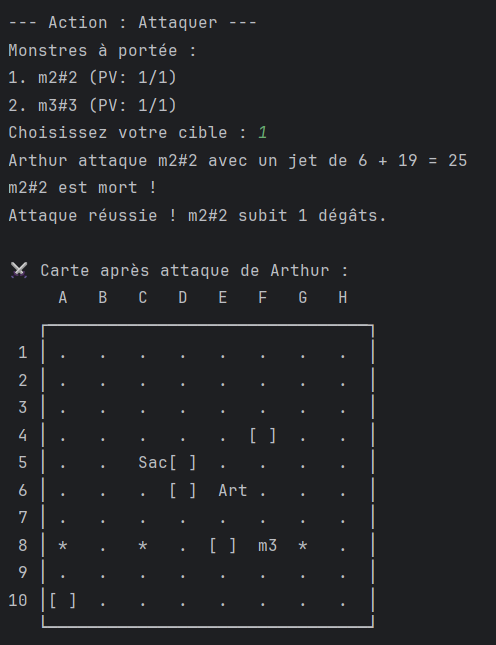
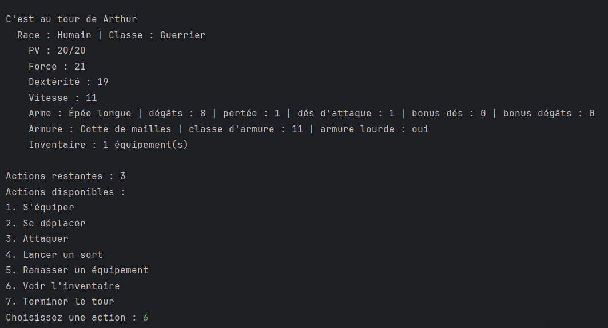
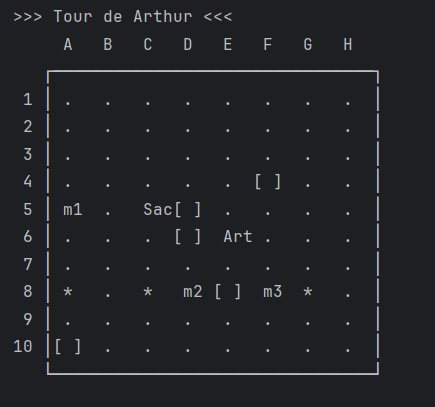

# Doojons and Dragons 🎲  
[English version below](#english-version)

Projet pédagogique en Java (POO / jeu) : mini RPG textuel mettant en oeuvre la programmation orientée objet, l'héritage, les interfaces et la gestion basique d'une boucle de jeu, d'inventaire et de sauvegarde.

---

## 👥 Contributeurs
| Nom | GitHub |
|-----|--------|
| Arthur ALEXANDRE | [@ArthurALEXANDRE-29](https://github.com/ArthurALEXANDRE-29) |
| Alexandru Vlaicu | [@Just-Alex67](https://github.com/Just-Alex67) |

---

## 🖼️ Aperçu

| Attaquer | Tour du joueur | Map du jeu |
|---------:|:--------------:|:----------:|
|  |  |  |


---

## ✨ Fonctionnalités (résumé)
- Création et gestion de personnages (classes, statistiques, inventaire)
- Système de combat tour par tour basique
- Objets consommables et équipements
- Ennemis et rencontres aléatoires
- Gestion de l'expérience et montée de niveau
- Sauvegarde / chargement simple (fichiers)
- Architecture orientée objet (héritage, interfaces, encapsulation)

---

## 🚀 Installation & Lancement (Version Simplifiée)

Prérequis :
- JDK 24 installé
- Un terminal ou un IDE Java (IntelliJ IDEA, Eclipse, VS Code)

1. Cloner le projet  
   ```bash
   git clone https://github.com/ArthurALEXANDRE-29/doojons-and-dragons.git
   ```
2. Lancer une partie
   ```bash
   Ouvrir votre éditeur et lancer le fichier Main.java
   ```

---

## 📁 Structure
```
.
├── README.md
├── .gitignore
├── src/ 
│   └── Main.java
├── assets/  
├── tests/
├── UML /
└── build/ target/ out/ 
```

---

## 📋 Cahier des charges (avancement)
| Élément | Statut |
|---------|--------|
| Création personnage | ✔️ |
| Système de combat | ✔️ |
| Inventaire / objets | ✔️ |
| Ennemis / rencontres | ✔️ |
| Sauvegarde / chargement | ✔️ |
| Ajouts UI (console améliorée) | ⚪ |
| Tests unitaires | ⚪ |

---

## 📝 Licence
Projet académique – usage pédagogique.

---

# English Version

## Overview
Educational Java project (OOP / game): a small text-based RPG showcasing object-oriented design (classes, inheritance, interfaces), a turn-based combat loop, inventory management and basic save/load.

---

## 👥 Contributors
| Name | GitHub |
|------|--------|
| Arthur ALEXANDRE | [@ArthurALEXANDRE-29](https://github.com/ArthurALEXANDRE-29) |
| Alexandru Vlaincu | [@Just-Alex67](https://github.com/Just-Alex67) |

---

## 🖼️ Screenshots

| Attack | Player turn | Game map |
|------:|:------------:|:--------:|
|  |  |  |


---

## ✨ Features (summary)
- Character creation and management (classes, stats, inventory)
- Turn-based combat system
- Consumables and equipment
- Enemies and random encounters
- Experience and leveling
- Simple save/load to files
- OOP-based architecture (inheritance, interfaces, encapsulation)

---

## 🚀 Quick Setup
Requirements:
- JDK 11+ installed
- Terminal or Java IDE (IntelliJ IDEA, Eclipse, VS Code)

1. Clone repository  
   ```bash
   git clone https://github.com/ArthurALEXANDRE-29/doojons-and-dragons.git
   ```
2. Run the game
    ```bash
   execute Main.java in your IDE
   ```

---

## 📁 Structure (simplified)
```
.
├── README.md
├── .gitignore
├── src/ 
│   └── Main.java
├── assets/  
├── tests/
├── UML /
└── build/ target/ out/ 
```

---

## 📋 Requirements Progress
| Item | Status |
|------|--------|
| Character system | ✔️ |
| Combat system | ✔️ |
| Inventory / items | ✔️ |
| Enemies / encounters | ✔️ |
| Save / load | ✔️ |
| Console UI improvements | ⚪ |
| Unit tests | ⚪ |

---

## 📝 License
Academic project – educational use.
